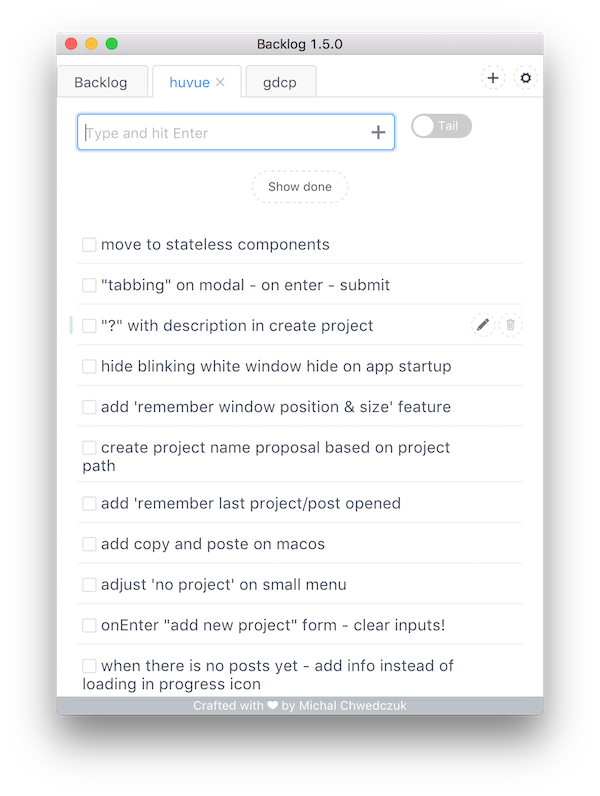

# backlog

> Simple multiplatform desktop app for storing TODOs, ideas or backlog items. 
> You can organize them with boards. No dependencies, no internet connection required, 
> no external accounts. Sleek flow.

<p align="center">

</p>


# Download
- [Windows version](http://czytelny.com/download/Backlog-win32-x64.zip)
- [MacOs version](http://czytelny.com/download/Backlog-darwin-x64.zip) 
- [Linux version](http://czytelny.com/download/Backlog-linux-x64.tar.gz)

or previev latest [release notes](https://github.com/czytelny/backlog/releases/latest)

## Screenshot


### Why ?
While programming I often have number of ideas related to possible improvements to implement
in the future. Or thoughts about cool new project which I should start. Most often it's one sentence or 
couple of words - just a draft of idea to expand in the future. 

I know, there are hundreds of *todo list managers* or other *notes manager*,
but this one will eventually fulfill my needs perfectly. 
I write my thoughts on some sticky notes, I tried Evernote, Simplenote... 
They are fine, but all of them was either bloated with unnecessary features or lack of desired "flow" - 
when I open program I want type down thoughts, hit enter, and get back to my actual work.  
No dependencies, no internet connection required, no external accounts etc.


### How ?
It's builded with `Electron` and `Vue.js`. Component framework is `iView`

#### Build Setup
You can build it yourself instead of downloading executable:

``` bash
# install dependencies
npm install

# serve with hot reload at localhost:9080
npm run dev

# build electron application for production
npm run build


# lint all JS/Vue component files in `src/`
npm run lint

```

---

This project was generated with [electron-vue](https://github.com/SimulatedGREG/electron-vue)@[ef811ba](https://github.com/SimulatedGREG/electron-vue/tree/ef811ba974d696ee965da747315f20a034ebc590) using [vue-cli](https://github.com/vuejs/vue-cli). Documentation about the original structure can be found [here](https://simulatedgreg.gitbooks.io/electron-vue/content/index.html).
